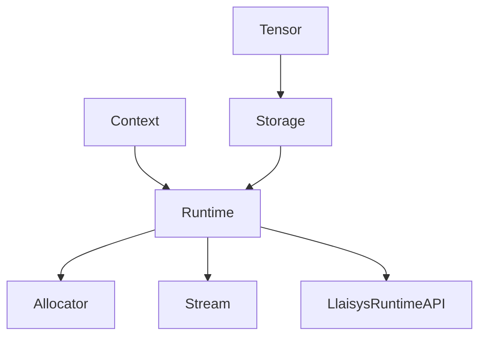

# LLAISYS 框架描述

本文面向快速理解 LLAISYS 的整体架构，重点讲清楚 `core` 与 `device` 两个目录的职责边界、对象关系和调用路径。

## 1. 总体分层

LLAISYS 后端是 C++（编译成共享库 + C API），前端是 Python（ctypes 调 C API）。

后端按职责可分为四层：

1) **设备抽象层（device/runtime api）**
- 统一抽象设备能力：分配/释放、拷贝、同步、stream 等
- 位置：`src/device/*` + `include/llaisys/runtime.h`

2) **核心资源管理层（core）**
- Context：线程局部“当前设备”与 Runtime 缓存
- Runtime：某个设备的资源管理器（allocator、stream、api）
- Storage：真实内存块（host 或 device），Tensor 共享的底层存储
- 位置：`src/core/*`

3) **Tensor 层**
- Tensor = meta(shape/strides/dtype) + storage + offset
- 负责 view/permute/slice 等视图变换与 load/to 数据搬运
- 位置：`src/tensor/*`

4) **算子层（ops）**
- 每个算子对外一个入口，内部按设备分发到 cpu/nvidia 实现
- 算子只对已在设备上的内存做计算，不负责搬运数据
- 位置：`src/ops/*`

Python 侧只是对 C API 的封装与测试入口，不改变上述职责划分。

---

## 2. core 目录详解

core 是资源管理中枢，负责“选择哪个设备”和“如何管理设备资源”。

### 2.1 Context（线程局部设备上下文）

关键特性：
- **线程局部**：每个线程有一个 Context（thread_local）
- 维护 `device_type -> [Runtime*]` 的表，并持有 `_current_runtime`
- 提供 `setDevice(device_type, device_id)`，切换当前活跃设备

理解方式：Context 是“当前线程正在使用哪块设备”的开关和缓存器。

### 2.2 Runtime（设备资源管理器）

Runtime 绑定一个 `(device_type, device_id)`，主要包含：
- `api()`：该设备类型对应的 `LlaisysRuntimeAPI` 函数表
- `stream()`：该 runtime 的 stream
- `allocator`：设备内存分配器

Runtime 不关心 Tensor 的形状；它只提供通用的“设备能力”。

### 2.3 Storage（真实内存块）

Storage 持有：
- `_memory`：指向真实内存（host 或 device）的指针
- `_size`：字节数
- `_runtime`：用于释放这段内存的 runtime
- `_is_host`：是否 host 内存

关键点：
- Tensor 共享 Storage，所以视图操作只改 meta/offset，不复制内存

### 2.4 core 中的对象关系（简化）



---

## 3. device 目录详解

device 目录是“设备能力”的统一抽象与具体实现。其核心是 `LlaisysRuntimeAPI`。

### 3.1 Runtime API 抽象

`include/llaisys/runtime.h` 定义了通用 Runtime API（函数指针表）：
- device：`get_device_count / set_device / device_synchronize`
- stream：`create_stream / destroy_stream / stream_synchronize`
- memory：`malloc_device / free_device / malloc_host / free_host`
- memcpy：`memcpy_sync / memcpy_async`

后端通过 `llaisysGetRuntimeAPI(device_type)` 获取某种设备的 API。

### 3.2 CPU 实现

CPU 版本在 `src/device/cpu/cpu_runtime_api.cpp`：
- malloc/free -> `std::malloc/std::free`
- memcpy -> `std::memcpy`
- stream/sync -> no-op

### 3.3 NVIDIA 实现

NVIDIA 版本在 `src/device/nvidia/nvidia_runtime_api.cu`。
该文件需要用 CUDA Runtime API 实现同样的接口：
- `cudaGetDeviceCount / cudaSetDevice / cudaDeviceSynchronize`
- `cudaStreamCreate/Destroy/Synchronize`
- `cudaMalloc/cudaFree`
- `cudaMallocHost/cudaFreeHost`（或 `cudaHostAlloc`）
- `cudaMemcpy/cudaMemcpyAsync`

只要 runtime api 正确实现，Tensor 和 ops 就可以不改动地在 NVIDIA 上工作。

---

## 4. Tensor 与 core/device 的关系

核心认知：

- **Context/Runtime 决定“用哪个设备 API 干活”。**
- **Storage 决定“数据实际在哪”。**

### 4.1 什么时候会发生 memcpy

只有在 Tensor 层的这些操作会拷贝：
- `Tensor::load(src_host_ptr)`：Host -> Tensor 所在设备
- `Tensor::to(target_device)`：当前设备 -> 目标设备
- debug/打印时可能会 D2H 拉回

算子层只对现有 device 指针做计算，一般不做 memcpy。

---

## 5. 从 Python 调用到设备执行的路径

```mermaid
flowchart TD
  A[Python/CPP 用户代码] --> B[Tensor::create / to / load]
  B --> C[Context::setDevice]
  C --> D[Runtime(api/stream/allocator)]
  D --> E[allocateHostStorage / allocateDeviceStorage]
  B --> F[memcpy_sync: H2D/D2H/D2D]

  A --> G[llaisys::ops::add]
  G --> H{tensor.deviceType}
  H -->|CPU| I[cpu::add]
  H -->|NVIDIA| J[nvidia::add]
  J --> K[CUDA kernel launch]
  K --> L[写回 device memory]
```

---

## 6. 常见误区

### Q1：`setDevice` 后，数据会自动到 GPU 吗？

不会。`setDevice` 只是切换当前 runtime。
数据是否在 GPU 取决于 Tensor 的 Storage 是否是 device 内存。

### Q2：为什么算子里不做 `cudaMemcpy`？

因为职责分离：
- Tensor 层统一管理数据位置与搬运
- ops 层只做计算，避免重复拷贝与难以维护

---

## 7. 推荐阅读顺序（快速上手）

1) core 与 device：
- `src/core/context/*`
- `src/core/runtime/*`
- `src/core/storage/*`
- `include/llaisys/runtime.h`
- `src/device/runtime_api.cpp`
- `src/device/cpu/cpu_runtime_api.cpp`

2) Tensor 数据搬运：
- `src/tensor/tensor.cpp`

3) ops 分发入口：
- `src/ops/add/op.cpp`

如果需要，我可以根据你正在看的模块再补充更细的调用链或时序图。
