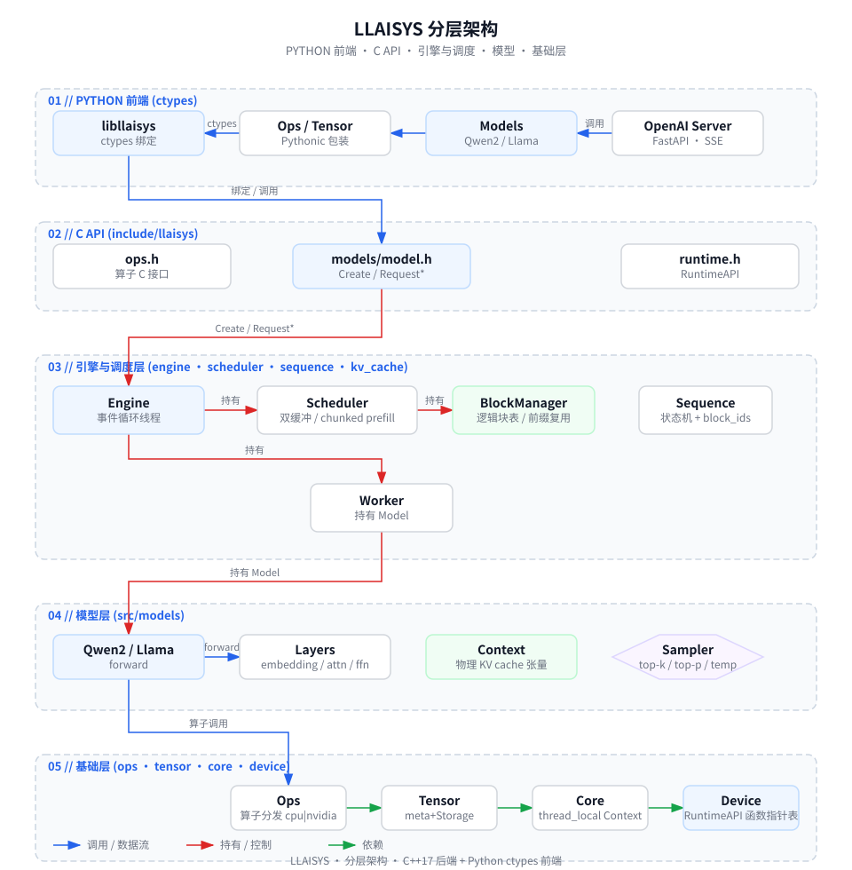
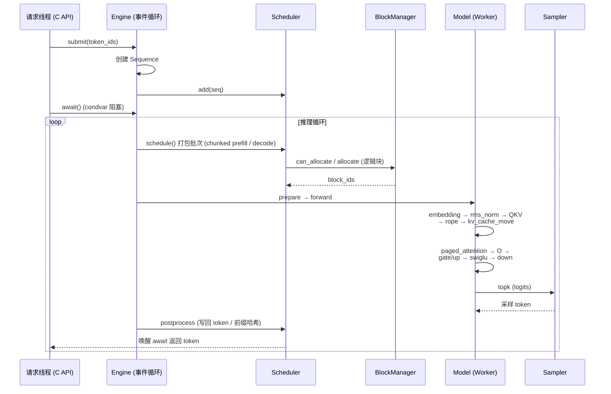

# LLAISYS

**LLAISYS** 是一个自底向上实现的高性能 LLM 推理框架。后端用 C++17 编写并以共享库形式暴露纯 C API，前端用 Python 通过 `ctypes` 包装。框架从设备抽象、张量、算子、KV cache、调度器、采样器到模型层逐层实现，支持单机批量推理与 OpenAI 兼容的服务接口。

- **设备抽象**：通过函数指针表统一 CPU 与 NVIDIA GPU（CUDA / cuBLAS），切换设备只需一行 `context().setDevice(...)`。
- **性能**：paged KV cache、Flash Decoding、chunked prefill、抢占式批量调度；统一 INT8 量化（W8A8 权重 + INT8 KV cache，Hadamard 旋转抑制激活 outlier）让 decode 端到端提速 **+37.4%**（RTX 4060 Laptop 8GB）。
- **多架构**：同一套 CUDA 实现覆盖消费级 Ada（sm_89）与数据中心 Blackwell Ultra（sm_103 / B300）。
- **多模型**：原生实现 Qwen2 与 Llama，从 HuggingFace safetensors 直接加载权重。

---

## 核心特性

### 推理引擎
- **批量调度**：双缓冲 producer-consumer 调度器；请求线程 `add()`，推理循环 `schedule()`，支持并发多请求。
- **Chunked Prefill**：超长 prompt 拆分为多个 forward pass，避免超出批次 token 上限。
- **抢占淘汰**：KV cache 块耗尽时预emptively 淘汰运行中的序列。
- **KV Cache**：`BlockManager` 分页管理固定大小块，引用计数共享，基于 hash 的前缀匹配实现跨序列缓存复用，懒淘汰。
- **采样**：top-k → 拷回 CPU → top-k / top-p / temperature 采样。
- **请求生命周期**：`Sequence` 状态机 `WAITING → RUNNING → FINISHED`，支持 submit / await / abort / release。

### 注意力与量化
- **Paged Attention**：基于块 ID 表的分页注意力，是当前批量推理路径的实现；decode 采用 **Flash Decoding**（warp-per-q）重写版本。早期 v3/v6 实现通过 `llaisysFlashDecodingV3/V6` C API 保留作 A/B 基准（`xmake f --flash-v6-experiment=y` 编译选项）。
- **量化路径**（NVIDIA only）：
  - **W8A8 统一 INT8**：权重 INT8 + KV cache INT8，量化前做 K 维 Hadamard 旋转抑制激活 outlier；`quantize=True` 一键开启端到端量化。
  - **decode INT8 全链路**：融合量化算子（`rms_norm_quant` / `swiglu_quant` 直接输出 int8+scale）+ 手写 `dp4a` GEMV（M≤8，每 warp 一列、lane 4B 点积）+ `lm_head` 量化（467MB FP → 233MB I8），decode 端到端 **+37.4%**。
  - **INT8 KV cache**：`kv_cache_move` 量化写入 + `paged_attention` 反量化读取，同样显存下支持约 2× 更长序列。

### 算子库
CPU 与 NVIDIA 双实现（`src/ops/<name>/cpu|nvidia`）：

| 类别 | 算子 |
|---|---|
| 基础 | `add`、`argmax`、`embedding`、`linear`、`rms_norm`、`rope`、`rearrange`、`swiglu`、`top_k` |
| 注意力 | `self_attention`（旧连续张量版）、`paged_attention`、`kv_cache_move` |
| 量化 | `quantize_act`、`quantize_w8`、`linear_w8a8`、`dequant_w8`、`rms_norm_quant`、`swiglu_quant` |

### Python 层
- `Tensor` / `Ops` / `RuntimeAPI` 的 Pythonic 包装，底层为 `ctypes` 绑定。
- 模型加载：`load_causal_lm(model_path, device, quantize=False)`，自动识别 Qwen2 / Llama 架构。
- **OpenAI 兼容 Server**：`/health`、`/v1/models`、`/v1/chat/completions`（流式 + 非流式，SSE）、`/v1/completions`。

## 性能基准

同机对称脚本实测（详见 `test/benchmark/` 与 `test/profile/`）。

### RTX 4060 Laptop（8GB，WSL2、CUDA 13.0）

| 场景 | 结果 |
|---|---|
| Qwen2-1.5B 单请求 vs HF `generate` | **1.45×**（64.9 tok/s） |
| Qwen2-1.5B 单请求 INT8 | **89.2 tok/s**（decode 较 FP +37.4%） |
| Qwen2-1.5B 18 请求并发（FP） | **814.3 tok/s** |
| Qwen2-1.5B 18 请求并发（INT8） | **1014.4 tok/s** |

### NVIDIA B300（Blackwell Ultra，sm_103）

| 场景 | FP (BF16) | INT8 |
|---|---|---|
| Qwen2-1.5B 单请求 decode | **220.8 tok/s** | 147.0 tok/s |
| Qwen2-7B 单请求 decode | **134.6 tok/s** | 110.5 tok/s |
| Qwen2-1.5B 18 请求并发 | **2675.9 tok/s** | — |
| Qwen2-7B 126 请求并发 | **607.5 tok/s** | 334.3 tok/s |

> B300 带宽过剩，INT8 减半权重访存的收益消失，INT8 在大卡上慢于 FP；经算子优化后退化从 1.7× 收窄到 1.2×（与小卡结论相反）。

---

## 架构设计

LLAISYS 采用自底向上的分层架构，每一层只依赖其下层：

### 分层架构图



> 矢量图（Flat Icon 风格），由 [fireworks-tech-graph](https://github.com/yizhiyanhua-ai/fireworks-tech-graph) 生成。

**关键机制**：

- **设备抽象**：`LlaisysRuntimeAPI` 是一张函数指针表（malloc/free/memcpy/stream/sync），每种设备类型提供各自实现（CPU 用 libc，NVIDIA 用 CUDA Runtime）。`src/core` 中的 **thread_local Context** 管理每设备 Runtime/Storage/allocator——做设备工作前先 `context().setDevice(type, id)`。
- **张量**：`Tensor = TensorMeta(shape/strides/dtype) + Storage + offset`；`view`/`permute`/`slice` 共享底层 Storage，仅变更 meta。
- **算子分发**：每个算子入口做校验 + `setDevice` + 按 `deviceType()` switch 分发到 `cpu/` 或 `nvidia/`（CUDA 编译单元）。
- **执行循环**：Engine 拥有 Worker 与 Scheduler。事件循环线程依次调用 `scheduler->schedule()`（打包批次）→ `worker->prepare()` → `worker->forward()`（模型前向）→ `scheduler->postprocess()`（写回 token、前缀哈希复用）。真正的 worker 线程是 Engine 的 `_runner`，Worker 的 task/result 队列与自身线程为残留声明。
- **KV cache 物理 / 逻辑分离**：物理 KV cache 张量（`k_caches` / `v_caches`）由模型的 `Context` 持有；逻辑块表（块号 / 引用计数 / 前缀哈希）由 `Scheduler → BlockManager` 管理；两者经 `Sequence` 的 `block_ids` 块表桥接，在 `paged_attention` / `kv_cache_move` 内以 block_id 索引物理缓存。

### 单请求推理数据流



---

## 目录结构

```
llaisys/
├── include/llaisys/        # C API 头文件
│   ├── runtime.h           #   设备抽象 / RuntimeAPI
│   ├── ops.h               #   算子 C 接口
│   ├── tensor.h
│   └── models/model.h      #   模型统一 C 接口
├── src/                    # C++17 后端
│   ├── device/             #   设备抽象（cpu/ + nvidia/）
│   ├── core/               #   thread_local Context、allocator、storage
│   ├── tensor/             #   Tensor（view/permute/slice）
│   ├── ops/                #   算子：op.cpp 分发 + cpu/ + nvidia/
│   ├── kv_cache/           #   BlockManager（paged KV cache）
│   ├── sequence/           #   Sequence 状态机
│   ├── scheduler/          #   双缓冲 producer-consumer 调度
│   ├── sampler/            #   top-k/top-p/temperature 采样
│   ├── engine/             #   Engine + worker + registry
│   ├── models/             #   qwen2/ llama/ 具体实现
│   └── llaisys/            #   C API → C++ 桥接
├── python/llaisys/         # Python 前端
│   ├── tensor.py / ops.py / runtime.py
│   ├── models/             #   Qwen2 / Llama / factory / meta_utils
│   ├── server.py           #   OpenAI 兼容 Server
│   ├── schemas.py          #   Server 的 Pydantic 请求/响应模型
│   └── libllaisys/         #   ctypes 绑定（argtypes/restype）
├── test/                   # 测试与基准
│   ├── test_runtime.py / test_tensor.py
│   ├── ops/                #   单算子测试（逐个）
│   ├── test_infer.py       #   单请求推理正确性
│   ├── test_server*.py     #   Server / 温度采样测试
│   └── benchmark/          #   benchmark_infer / benchmark_batch_infer
├── xmake/                  # xmake 构建脚本（cpu.lua / nvidia.lua）
├── xmake.lua
└── .clang-format
```

---

## 构建与安装

### 环境准备

```bash
# 创建虚拟环境（可选，推荐）
python -m venv venv
source venv/bin/activate

# 安装 Python 依赖（torch、transformers、fastapi 等）
pip install -e ./python/     # 注意：必须 editable 安装
```

> **为什么必须 `-e`（editable）**：`xmake install` 会把 `.so` 拷到 `python/llaisys/libllaisys/`。非 editable 安装会在 site-packages 生成实拷贝，Python 运行时会加载旧的 `.so`，导致 C++ 改动不生效且无报错。排查：`import llaisys; print(llaisys.__file__)` 应指向源码目录。

### 编译 C++ 后端

```bash
# 纯 CPU 构建（默认）
xmake
xmake install

# NVIDIA GPU 构建（定义 ENABLE_NVIDIA_API，引入 CUDA + cuBLAS）
xmake f --nv-gpu=y -c      # -c 清理重配
xmake && xmake install
```

- **前置要求**：NVIDIA 构建需已安装 CUDA toolkit + cuBLAS（`xmake/nvidia.lua` 链接 `/usr/local/cuda/lib64`）。
- **GPU 架构按需设置**：默认 `sm_89`（RTX 4060 / Ada）；B300（Blackwell Ultra）改用 `sm_103`。更换 GPU 需编辑 `xmake/nvidia.lua` 的 `-gencode`。
- ⚠️ **改 C++ 后必须重新 `xmake install`**，否则 Python 加载的是旧 `.so`，改动不生效且无报错。若疑似陈旧，先 `xmake f --nv-gpu=y -c` 清理重配。
- 跨平台：构建逻辑与共享库拷贝支持 Linux（`.so`）与 Windows（`.dll`）。

---

## 快速开始

### Python API 推理

```python
import llaisys
from llaisys import DeviceType
from transformers import AutoTokenizer

model = llaisys.models.load_causal_lm(
    "/path/to/model-dir",        # HF 模型目录（safetensors）
    device=DeviceType.NVIDIA,
    quantize=False,              # True 启用 W8A8 + INT8 KV cache
)

tokenizer = AutoTokenizer.from_pretrained("/path/to/model-dir")
prompt = "介绍一下深度学习"
inputs = tokenizer.encode(prompt, add_special_tokens=False)

# generate 的输入、输出均为 token ID（list[int]），需用 tokenizer 编解码
output_ids = model.generate(inputs, max_new_tokens=64)
text = tokenizer.decode(output_ids, skip_special_tokens=True)
print(text)
```

### 启动 OpenAI 兼容 Server

```bash
python -m llaisys.server \
    --model /path/to/model-dir \
    --host 0.0.0.0 --port 8000 \
    --device nvidia              # 或 cpu
```

```bash
curl http://localhost:8000/v1/chat/completions \
  -H "Content-Type: application/json" \
  -d '{"model":"qwen2","messages":[{"role":"user","content":"你好"}],"stream":true}'
```

---

## 测试与基准

`--device` 取值 `cpu|nvidia`，默认 `cpu`。CI 只跑 CPU；GPU 测试在本地手动执行。

| 命令 | 用途 |
|---|---|
| `python test/test_runtime.py --device cpu\|nvidia` | Runtime API（设备/malloc/memcpy/stream） |
| `python test/test_tensor.py` | Tensor load/view/permute/slice |
| `python test/ops/<name>.py --device nvidia` | 单算子测试（add/argmax/…/paged_attention） |
| `python test/test_infer.py --device nvidia --model <path> --test` | 单请求推理正确性（对齐 HF，端到端验收） |
| `python test/test_server.py --model <path> --device nvidia` | OpenAI 兼容 Server 集成测试 |
| `python test/test_server_temperature.py` | 温度采样（无需 GPU） |
| `python test/test_request_lifetime.py` / `test_invalid_submit.py` | 请求生命周期 / 空提交拒绝 |
| `python test/test_weight_map.py` / `test_model_api_symbols.py` | HF 权重映射 / C API 符号完整性 |
| `python test/test_nsys_profile.py` | nsys 链路 profile 驱动 |
| `python test/benchmark/benchmark_infer.py --model <path>` | 单请求吞吐基准 |
| `python test/benchmark/benchmark_batch_infer.py --model <path>` | 并发批量吞吐基准 |
| `python test/benchmark/benchmark_w8a8.py --model <path>` | W8A8 量化微基准 + 端到端 |

共享测试工具在 `test/test_utils.py`（`random_tensor`、`check_equal`、`benchmark` 等），用于生成配对的 PyTorch + LLAISYS 张量并比对。

> 默认测试模型路径在测试中多处硬编码为 `DeepSeek-R1-Distill-Qwen-1.5B`，可用 `--model <path>` 指定其它模型。

> 注：**不存在** `test/test_ops.py` 或 `test/test_infer_batch.py`。算子测试逐个位于 `test/ops/`；批量吞吐用 `benchmark_batch_infer.py`。

---

## 关键配置（`src/config.hpp`）

| 常量 | 默认值 | 含义 |
|---|---|---|
| `KV_CACHE_BLOCK_SIZE` | 64 | 每块 token 数 |
| `KV_CACHE_BLOCK_NUM` | 128 | KV cache 总块数 |
| `TOP_K` / `TOP_P` | 10 / 0.9 | 默认采样参数 |
| `BATCH_MAX_TOKEN_NUM` | 8192 | 批次最大 token 数 |
| `BATCH_MAX_SEQ_NUM` | 64 | 批次最大序列数 |
| `MAX_TOKEN_NUM` | 2048 | 单序列最大长度 |

---

## 许可证

本项目以 MIT 许可证开源，详见 [LICENSE](./LICENSE)。
