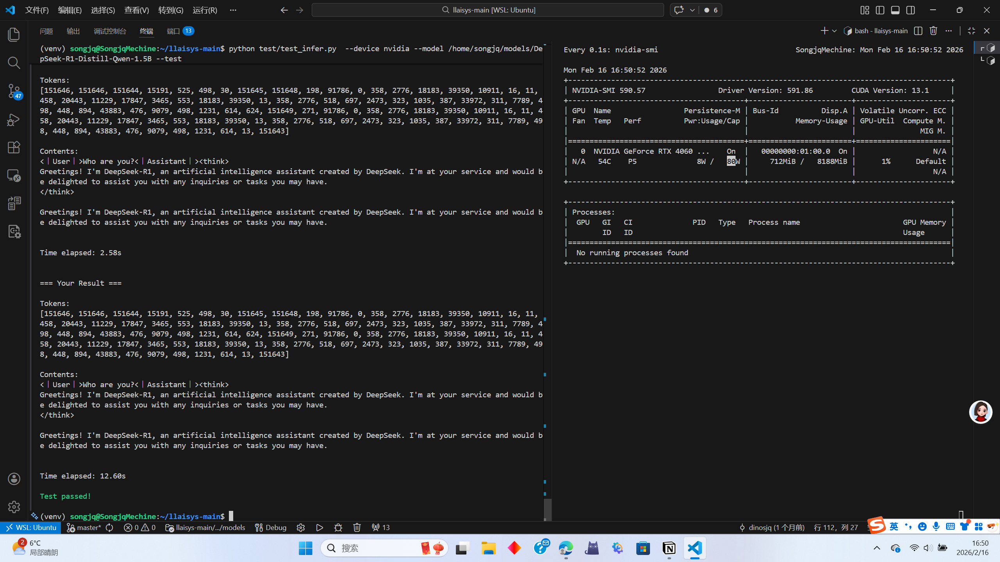

## nvidia_runtime_api 测试
```
(venv) songjq@SongjqMechine:~/llaisys-main$ python test/test_runtime.py --device nvidia 
Found 1 nvidia devices
Testing device {i}...
     Passed
Test passed!
```

## nvidia_tensor_func 测试
```
(venv) songjq@SongjqMechine:~/llaisys-main$ python test/test_tensor.py --device nvidia
===Test load===
Tensor: shape[ 3 4 5 ] strides[ 20 5 1 ] dtype=6
0 1 2 3 4 
5 6 7 8 9 
10 11 12 13 14 
15 16 17 18 19 
20 21 22 23 24 
25 26 27 28 29 
30 31 32 33 34 
35 36 37 38 39 
40 41 42 43 44 
45 46 47 48 49 
50 51 52 53 54 
55 56 57 58 59 
===Test view===
Tensor: shape[ 6 10 ] strides[ 10 1 ] dtype=6
0 1 2 3 4 5 6 7 8 9 
10 11 12 13 14 15 16 17 18 19 
20 21 22 23 24 25 26 27 28 29 
30 31 32 33 34 35 36 37 38 39 
40 41 42 43 44 45 46 47 48 49 
50 51 52 53 54 55 56 57 58 59 
===Test permute===
Tensor: shape[ 5 3 4 ] strides[ 1 20 5 ] dtype=6
0 5 10 15 
20 25 30 35 
40 45 50 55 
1 6 11 16 
21 26 31 36 
41 46 51 56 
2 7 12 17 
22 27 32 37 
42 47 52 57 
3 8 13 18 
23 28 33 38 
43 48 53 58 
4 9 14 19 
24 29 34 39 
44 49 54 59 
===Test slice===
Tensor: shape[ 3 4 3 ] strides[ 20 5 1 ] dtype=6
1 2 3 
6 7 8 
11 12 13 
16 17 18 
21 22 23 
26 27 28 
31 32 33 
36 37 38 
41 42 43 
46 47 48 
51 52 53 
56 57 58 

Test passed!
```

## nvidia_ops 各种算子的 cuda 实现测试
```
(venv) songjq@SongjqMechine:~/llaisys-main$ python test/ops/add.py --device nvidia
python test/ops/argmax.py --device nvidia
python test/ops/embedding.py --device nvidia
python test/ops/linear.py --device nvidia
python test/ops/rms_norm.py --device nvidia
python test/ops/rope.py --device nvidia
python test/ops/self_attention.py --device nvidia
python test/ops/swiglu.py --device nvidia
Testing Ops.add on nvidia
   shape (2, 3) dtype <f32>
   shape (2, 3) dtype <f16>
   shape (2, 3) dtype <bf16>
   shape (512, 4096) dtype <f32>
   shape (512, 4096) dtype <f16>
   shape (512, 4096) dtype <bf16>
Test passed!

Testing Ops.argmax on nvidia
   shape (4,) dtype <f32>
   shape (4,) dtype <f16>
   shape (4,) dtype <bf16>
   shape (4096,) dtype <f32>
   shape (4096,) dtype <f16>
   shape (4096,) dtype <bf16>
Test passed!

Testing Ops.embedding on nvidia
   idx_shape (1,) embd_shape (2, 3) dtype <f32>
   idx_shape (1,) embd_shape (2, 3) dtype <f16>
   idx_shape (1,) embd_shape (2, 3) dtype <bf16>
   idx_shape (50,) embd_shape (512, 4096) dtype <f32>
   idx_shape (50,) embd_shape (512, 4096) dtype <f16>
   idx_shape (50,) embd_shape (512, 4096) dtype <bf16>
Test passed!

Testing Ops.linear on nvidia
   out (2, 3), x (2, 4), w (3, 4), bias True, dtype <f32>
   out (2, 3), x (2, 4), w (3, 4), bias True, dtype <f16>
   out (2, 3), x (2, 4), w (3, 4), bias True, dtype <bf16>
   out (512, 4096), x (512, 4096), w (4096, 4096), bias True, dtype <f32>
   out (512, 4096), x (512, 4096), w (4096, 4096), bias True, dtype <f16>
   out (512, 4096), x (512, 4096), w (4096, 4096), bias True, dtype <bf16>
Test passed!

Testing Ops.rms_norm on nvidia
   shape (1, 4) dtype <f32>
   shape (1, 4) dtype <f16>
   shape (1, 4) dtype <bf16>
   shape (512, 4096) dtype <f32>
   shape (512, 4096) dtype <f16>
   shape (512, 4096) dtype <bf16>
Test passed!

Testing Ops.rope on nvidia
   shape (2, 1, 4) range (0, 2) dtype <f32>
   shape (2, 1, 4) range (0, 2) dtype <f16>
   shape (2, 1, 4) range (0, 2) dtype <bf16>
   shape (512, 4, 4096) range (512, 1024) dtype <f32>
   shape (512, 4, 4096) range (512, 1024) dtype <f16>
   shape (512, 4, 4096) range (512, 1024) dtype <bf16>
Test passed!

Testing Ops.self_attention on nvidia
   qlen=2 kvlen=2 nh=1 nkvh=1 hd=4 dtype <f32>
   qlen=2 kvlen=2 nh=1 nkvh=1 hd=4 dtype <f16>
   qlen=2 kvlen=2 nh=1 nkvh=1 hd=4 dtype <bf16>
   qlen=5 kvlen=11 nh=4 nkvh=2 hd=8 dtype <f32>
   qlen=5 kvlen=11 nh=4 nkvh=2 hd=8 dtype <f16>
   qlen=5 kvlen=11 nh=4 nkvh=2 hd=8 dtype <bf16>
Test passed!

Testing Ops.swiglu on nvidia
   shape (2, 3) dtype <f32>
   shape (2, 3) dtype <f16>
   shape (2, 3) dtype <bf16>
   shape (512, 4096) dtype <f32>
   shape (512, 4096) dtype <f16>
   shape (512, 4096) dtype <bf16>
Test passed!
```

## nvidia_sys 生成对话测试
```
(venv) songjq@SongjqMechine:~/llaisys-main$ python test/test_infer.py  --device nvidia --model /home/songjq/models/DeepSeek-R1-Distill-Qwen-1.5B --test
`torch_dtype` is deprecated! Use `dtype` instead!
The attention mask and the pad token id were not set. As a consequence, you may observe unexpected behavior. Please pass your input's `attention_mask` to obtain reliable results.
Setting `pad_token_id` to `eos_token_id`:151643 for open-end generation.
The attention mask is not set and cannot be inferred from input because pad token is same as eos token. As a consequence, you may observe unexpected behavior. Please pass your input's `attention_mask` to obtain reliable results.
Loading model from local path: /home/songjq/models/DeepSeek-R1-Distill-Qwen-1.5B

=== Answer ===

Tokens:
[151646, 151646, 151644, 15191, 525, 498, 30, 151645, 151648, 198, 91786, 0, 358, 2776, 18183, 39350, 10911, 16, 11, 458, 20443, 11229, 17847, 3465, 553, 18183, 39350, 13, 358, 2776, 518, 697, 2473, 323, 1035, 387, 33972, 311, 7789, 498, 448, 894, 43883, 476, 9079, 498, 1231, 614, 624, 151649, 271, 91786, 0, 358, 2776, 18183, 39350, 10911, 16, 11, 458, 20443, 11229, 17847, 3465, 553, 18183, 39350, 13, 358, 2776, 518, 697, 2473, 323, 1035, 387, 33972, 311, 7789, 498, 448, 894, 43883, 476, 9079, 498, 1231, 614, 13, 151643]

Contents:
<｜User｜>Who are you?<｜Assistant｜><think>
Greetings! I'm DeepSeek-R1, an artificial intelligence assistant created by DeepSeek. I'm at your service and would be delighted to assist you with any inquiries or tasks you may have.
</think>

Greetings! I'm DeepSeek-R1, an artificial intelligence assistant created by DeepSeek. I'm at your service and would be delighted to assist you with any inquiries or tasks you may have.


Time elapsed: 2.45s


=== Your Result ===

Tokens:
[151646, 151646, 151644, 15191, 525, 498, 30, 151645, 151648, 198, 91786, 0, 358, 2776, 18183, 39350, 10911, 16, 11, 458, 20443, 11229, 17847, 3465, 553, 18183, 39350, 13, 358, 2776, 518, 697, 2473, 323, 1035, 387, 33972, 311, 7789, 498, 448, 894, 43883, 476, 9079, 498, 1231, 614, 624, 151649, 271, 91786, 0, 358, 2776, 18183, 39350, 10911, 16, 11, 458, 20443, 11229, 17847, 3465, 553, 18183, 39350, 13, 358, 2776, 518, 697, 2473, 323, 1035, 387, 33972, 311, 7789, 498, 448, 894, 43883, 476, 9079, 498, 1231, 614, 13, 151643]

Contents:
<｜User｜>Who are you?<｜Assistant｜><think>
Greetings! I'm DeepSeek-R1, an artificial intelligence assistant created by DeepSeek. I'm at your service and would be delighted to assist you with any inquiries or tasks you may have.
</think>

Greetings! I'm DeepSeek-R1, an artificial intelligence assistant created by DeepSeek. I'm at your service and would be delighted to assist you with any inquiries or tasks you may have.


Time elapsed: 12.96s

Test passed!
```


